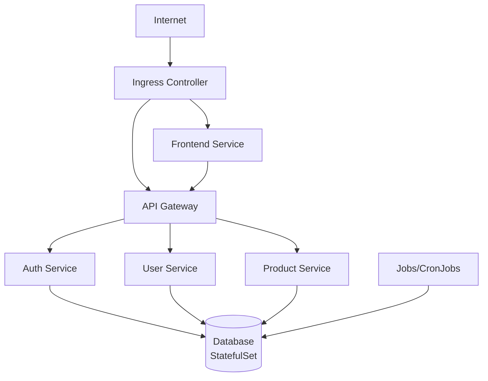

# Kubernetes Microservices Demo

A comprehensive microservices demonstration project showcasing production-ready Kubernetes patterns and best practices. This project focuses on demonstrating Kubernetes knowledge rather than complex application logic.

## 🏗️ Architecture



## ✨ Features Demonstrated

### Core Kubernetes Resources
- ✅ **Deployments** - All 5 microservices
- ✅ **StatefulSet** - PostgreSQL database with persistent storage
- ✅ **Services** - ClusterIP services for internal communication
- ✅ **ConfigMaps & Secrets** - Configuration and sensitive data management
- ✅ **Ingress** - External access with path-based routing

### Security & Access Control
- ✅ **RBAC** - ServiceAccounts, Roles, and RoleBindings for each service
- ✅ **Network Policies** - Default deny-all with specific allow rules
- ✅ **Resource Management** - ResourceQuotas and LimitRanges

### Automation & Scaling
- ✅ **Jobs** - One-time database tasks
- ✅ **CronJobs** - Scheduled backups and cleanup tasks
- ✅ **HPA** - Horizontal Pod Autoscaler for CPU-based scaling
- ✅ **Helm Charts** - Package management for all services

## 🚀 Quick Start

### Prerequisites

- Kubernetes cluster (local or remote)
- `kubectl` configured
- `helm` 3.x installed
- `docker` running
- Ingress Controller (nginx) installed

### Deploy Everything

```bash
# Deploy complete stack (infrastructure + services)
./scripts/deploy-all.sh

# Check status
./scripts/show-status.sh

# Verify health
./scripts/check-health.sh
```

### Access the Application

- **Frontend**: http://localhost/
- **API Gateway**: http://localhost/api/health
- **Default Login**: `testuser` / `testpass123`

## 📋 Useful Commands

### Deployment & Management

```bash
# Deploy everything
./scripts/deploy-all.sh

# Build all Docker images
./scripts/build-images.sh

# Install services with Helm
./scripts/install-helm-charts.sh

# Check overall status
./scripts/show-status.sh

# Health check all services
./scripts/check-health.sh

# Complete cleanup (removes everything)
./scripts/cleanup-all.sh

# Cleanup but keep Docker images
./scripts/cleanup-all.sh --skip-images
```

### Database Access

```bash
# Create test user in database
./scripts/create-test-user.sh

# Port forward to access database locally
kubectl port-forward -n k8s-microservices svc/postgres 5432:5432

# Connect to database
kubectl exec -it -n k8s-microservices postgres-0 -- psql -U postgres -d microservices_db
```

### Monitoring & Debugging

```bash
# View all resources
kubectl get all -n k8s-microservices

# Check pod logs
kubectl logs -n k8s-microservices -l app.kubernetes.io/name=auth-service --tail=50

# Describe a resource
kubectl describe pod <pod-name> -n k8s-microservices

# Check Helm releases
helm list -n k8s-microservices

# View events
kubectl get events -n k8s-microservices --sort-by='.lastTimestamp'
```

### Service-Specific Commands

```bash
# Restart a service
kubectl rollout restart deployment <service-name> -n k8s-microservices

# Scale a service manually
kubectl scale deployment <service-name> --replicas=3 -n k8s-microservices

# Port forward to a service
kubectl port-forward -n k8s-microservices svc/<service-name> 3000:3000
```

## 📁 Project Structure

```
kubernetes_demo/
├── app/
│   ├── services/          # Microservices (auth, user, product, api-gateway, frontend)
│   ├── database/          # PostgreSQL StatefulSet
│   ├── ingress/           # Ingress resources
│   ├── rbac/              # ServiceAccounts, Roles, RoleBindings
│   ├── network-policies/  # Network security policies
│   ├── resource-management/ # ResourceQuotas and LimitRanges
│   ├── jobs/              # Jobs and CronJobs
│   └── helm-charts/       # Helm charts for all services
└── scripts/               # Deployment and management scripts
```

## 🔐 Security Features

- **RBAC**: Each service has its own ServiceAccount with minimal required permissions
- **Network Policies**: Default deny-all with explicit allow rules for:
  - Ingress Controller → Frontend/API Gateway
  - API Gateway → Backend Services
  - Services → Database
  - Frontend → API Gateway
- **Resource Limits**: CPU and memory limits on all pods
- **Secrets**: Database credentials stored in Kubernetes Secrets

## 📊 Services Overview

| Service | Purpose | Endpoints |
|---------|---------|-----------|
| **Frontend** | Next.js dashboard UI | `/` |
| **API Gateway** | Request routing | `/api/*` |
| **Auth Service** | JWT authentication | `/api/auth/login`, `/api/auth/validate` |
| **User Service** | User CRUD operations | `/api/users/*` |
| **Product Service** | Product catalog | `/api/products/*` |
| **PostgreSQL** | Data persistence | Internal only |

## 🎯 What This Demo Shows

This project demonstrates:

1. **Microservices Architecture** - Multiple independent services communicating via API Gateway
2. **Kubernetes Best Practices** - Production-ready configurations
3. **Security** - RBAC and Network Policies for defense in depth
4. **Resource Management** - Quotas and limits to prevent resource exhaustion
5. **Automation** - Jobs and CronJobs for operational tasks
6. **Scaling** - HPA for automatic scaling based on CPU
7. **Package Management** - Helm charts for easy deployment
8. **Infrastructure as Code** - All resources defined in YAML

## 🛠️ Development

### Rebuild a Service

```bash
# Rebuild specific service
cd app/services/<service-name>
docker build -t <service-name>:latest .

# Restart the service
kubectl rollout restart deployment <service-name> -n k8s-microservices
```

### Local Development

```bash
# Run services locally (requires Node.js)
cd app/services/<service-name>
npm install
npm start
```

## 📚 Documentation

- [Scripts Documentation](./scripts/README.md) - Detailed script usage
- [RBAC Setup](./app/rbac/README.md) - Security configuration
- [Network Policies](./app/network-policies/README.md) - Network security
- [Helm Charts](./app/helm-charts/README.md) - Package management
- [Jobs & CronJobs](./app/jobs/README.md) - Automated tasks

## 🧪 Testing

```bash
# Test API Gateway health
curl http://localhost/api/health

# Test login endpoint
curl -X POST http://localhost/api/auth/login \
  -H "Content-Type: application/json" \
  -d '{"username":"testuser","password":"testpass123"}'
```

## 🧹 Cleanup

```bash
# Remove everything (with confirmation)
./scripts/cleanup-all.sh

# Remove everything including Docker images
./scripts/cleanup-all.sh

# Skip confirmation
./scripts/cleanup-all.sh --force
```

## 📝 Notes

- This is a **demo project** for learning Kubernetes concepts
- Application code is intentionally minimal to focus on K8s patterns
- All services use `imagePullPolicy: Never` for local Docker images
- Database data persists via PersistentVolumeClaims
- Default credentials are for demo purposes only

## 🤝 Contributing

This is a learning/demonstration project. Feel free to fork and experiment!

---

**Built to demonstrate comprehensive Kubernetes knowledge and production-ready patterns.**

